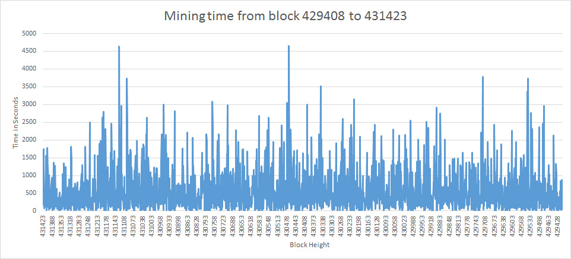

## Question:

What is the average amount of time between blocks mined?

## What Blocks:

Blocks [429408](https://blockchain.info/block-height/429408) - [431423](https://blockchain.info/block-height/431423)

Difficulty : 225,832,872,179.46

## Data

Data was from https://api.blocktrail.com/ stored into local-data.json as to not use a bunch of API calls.

## Process

- Collected data from Blocktrail on the blocks listed above.
- Wrote [JavaScript](time.js) to parse data and convert to [CSV](data/difference.csv)
- Used Excel to create graph, average and highest and lowest blocks

## Results

### Average

563 seconds or 9:23

As a result, the difficulty was increased to 241,227,200,229.99 for the next block: [431424](https://blockchain.info/block-height/431424)

### Longest

[430469](https://blockchain.info/block-height/430469) - [430470](https://blockchain.info/block-height/430470) 

4656 seconds or 1:17:36

### Shortest

[430272](https://blockchain.info/block-height/430272) - [430273](https://blockchain.info/block-height/430273) 

Less than 1 second (2016-09-17 19:00:39 to 	2016-09-17 19:00:40)

## Contribute

Yes Please!
